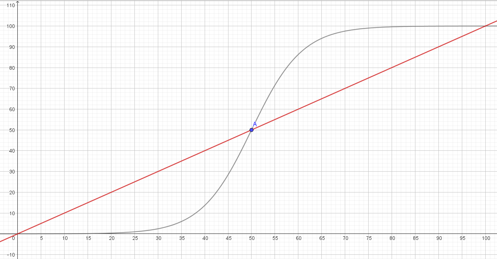
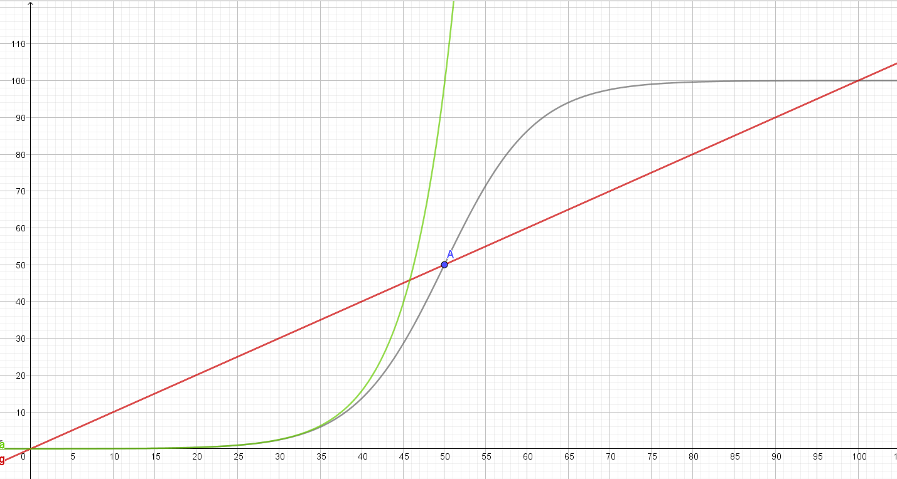

# Brightness Correction

When turning the rotary encoder for brightness, the scale, and thus the brightness, would be changed linearly. However, the resulting change of brightness doesn't seem linear to the human eye, and in order to fix that, I used a ~~logistic~~ *apparently exponential* function, that would convert the mathematically linear scale to perceptually linear scale.

> inspired from this answer on stack-exchange: https://electronics.stackexchange.com/a/11100



In the above image, the red line shows the linear scale of the direct input. The dark line is the logistic scale which should be applied to the LED's.

The function for logistic growth looks like this:
$$
f(x) = \frac{
	G \cdot f_0
}{
	f_0 + (G-f_0) \cdot e^{
		-k\cdot G \cdot x
	}
}
$$
Where $G$ is the upper boundary, $f_0$ the value of $f(0)$ and $k$ a factor (as it seems in $]0,1[$ ).

We know that $G=100$ and $f_0 = 0.01 \approx 0$ (the lowest value would be zero, but the function doesn't allow a start at zero, so we approximate it with 0.001). Also we know  that $f(x)$ includes $P(50|50)$. This way we can calculate $k$:
$$
\begin{align}
50 &= \frac{
	100 \cdot 0.01
}{
	0.01 + (100 - 0.01) \cdot e^{
		-k \cdot 100 \cdot 50
	}
}
\\
k &= 0.00184
\end{align}
$$


This gives us the equation for a corrected brightness:
$$
\begin{align}
\text{brightness} &= \frac{
	100 \cdot 0.01
}{
	0.01 + (100-0.01) \cdot
	e^{
		-0.00184 \cdot 100 \cdot \text{raw\_brightness}
	}
}
\\
\text{brightness} &= \frac{
	1
}{
	0.01 + (99.99) \cdot 
	e^{
		-0.184 \cdot \text{raw\_brightness}
	}
}
\\
\\
\text{brightness} &\approx \frac{
	1
}{
	100 \cdot 
	e^{
		-0.184 \cdot \text{raw\_brightness}
	}
}
\end{align}
$$
Which leads to the final code:

````c++
brightness = 1 / (100 * pow(2.718, -0.184 * raw_brightness));
if(brightness < 0 )
    brightness = 0;
else if(brightness > 100)
    brightness = 100;
````


---

EDIT:

the optimised function (in green) isn't logistic at all and doesn't strictly meet my requirements:



However, it still works well enough, except that i need to cap `raw_brightness` a little bit earlier than 100, but at 50. *it even feels somewhat better than not optimised logistic.*
